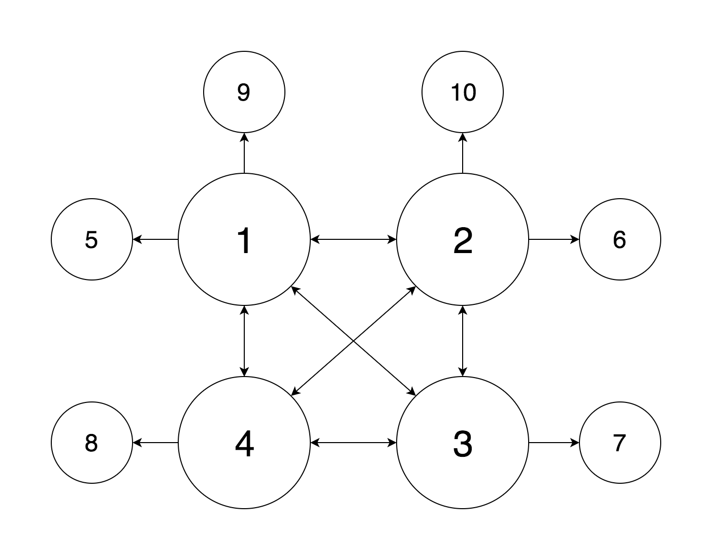

# CS425-MP2

## Usage of server
Git clone the repo to `$GOPATH/src/CS425`, then run the command below in `$GOPATH/src/CS425/CS425-MP2`

	$ go run main.go

## Usage of command line tool
Git clone the repo to `$GOPATH/src/CS425`, then run the command below in `$GOPATH/src/CS425/CS425-MP2`

	$ go run cli_tool/cli_tool [ nodeID | memberList | leave ]

## If you are using docker

	$ docker build -t cs425-mp2 .
	$ docker run -it --rm --name cs425-mp2 cs425-mp2

## Settings
Config.json looks like:

	{
	    "ip": "172.22.154.107",
	    "port": 8081,
	    "ping_timeout": 200,
	    "dissemination_timeout": 200,
	    "fail_timeout": 200,
	    "ttl": 3,
	    "log_path": "/tmp/mp2.log",
	    "period_time": 200,
	    "introducer_ip": "172.22.154.106"
	}

## Log
By default, all the log are written to `/tmp/mp2.log`, you could change the log path in config.json. You could monitor the log by:

	$ tail -f /tmp/mp2.log

If you are using docker, then use this to see the log:

	$ docker exec -it cs425-mp2 tail -f /tmp/mp2.log

The default output is /tmp/mp2.log, use:

	$ tail -f /tmp/mp2.log

to monitor the log.

## Topology
The topology shows as below. Instead of randomly ping every node in the membership list, we will generate a ping list from the membership list.
First, every node will chose the first 4 nodes in the membership list as "Core Node". The core nodes will put each other into the pinList.
Then the core node will chose "Leafe Node" if the leafeNode_index % 4 == coreNode_index. 

If node 1 fails, the topology will looks like:

